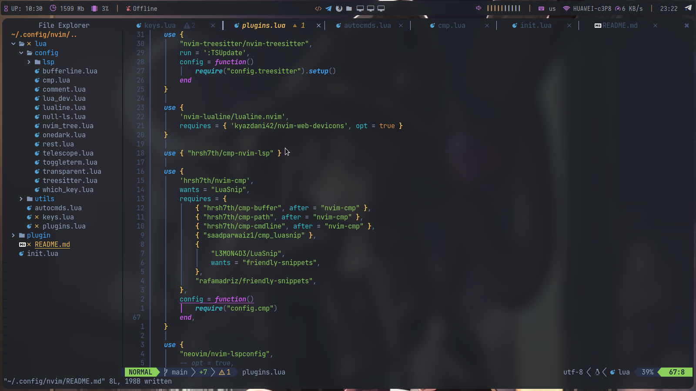
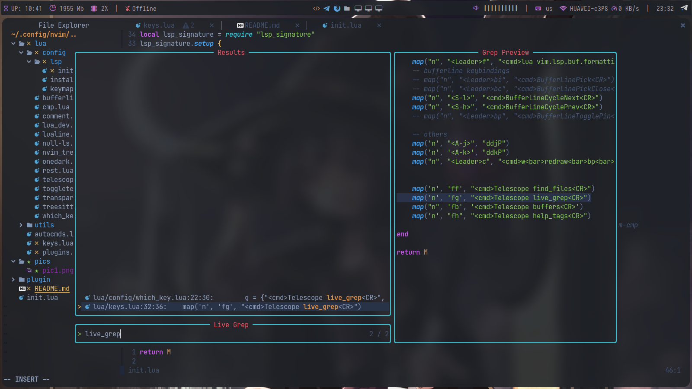

# My neovim configs

## Requirments
[`packer`](https://github.com/wbthomason/packer.nvim#quickstart)

## installation

Just clone the repo at `$HOME/.config/nvim/`, run neovim and use `:PackerSync`

### pictures

